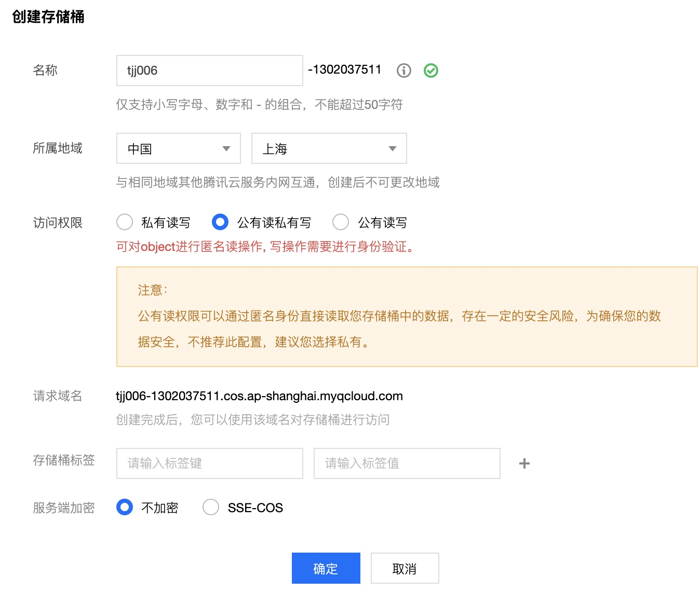
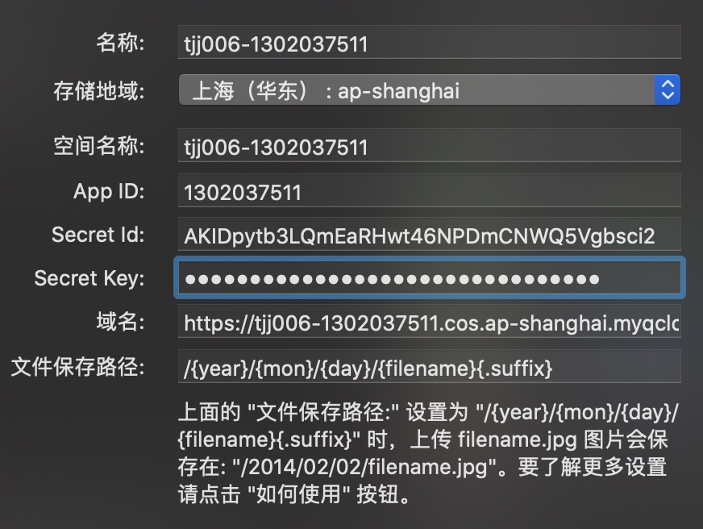
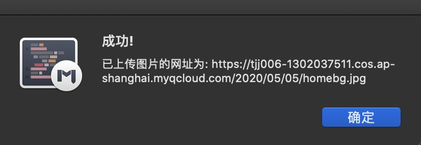
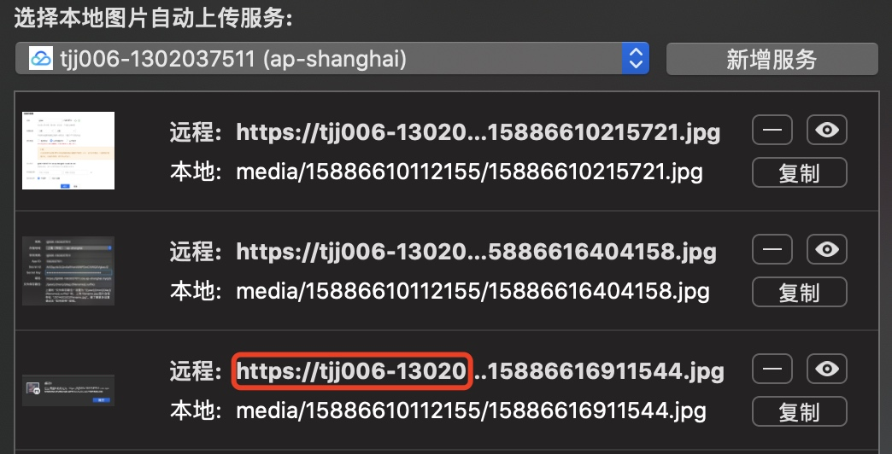

# MWeb使用腾讯云COS图床

- 名称：tjj006
- AppId：1302037511
- 域名：tjj006-1302037511.cos.ap-shanghai.myqcloud.com
- SecretId：AKIDpytb3LQmEaRHwt46NPDmCNWQ5Vgbsci2
- SecretKey：MSMzRhnmk****

> http://zh.mweb.im/how_to_use_tencent_cos.html.html

