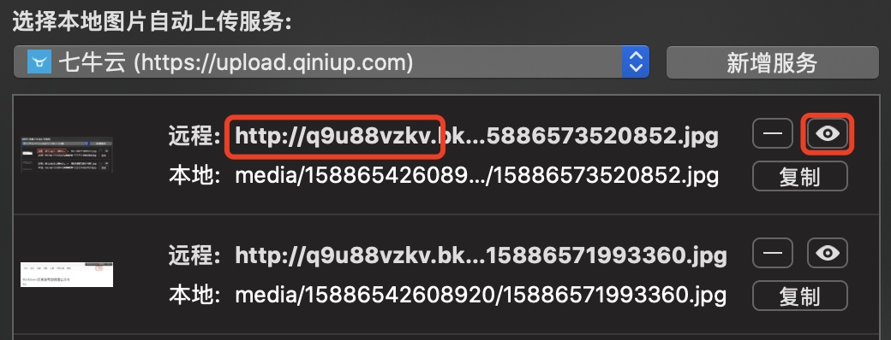
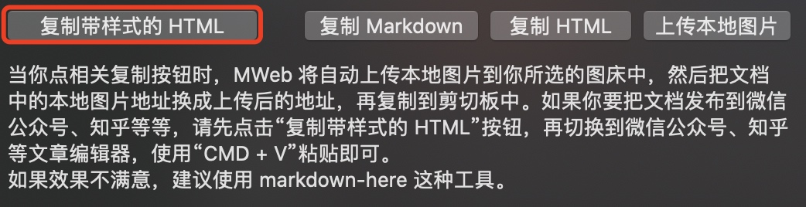
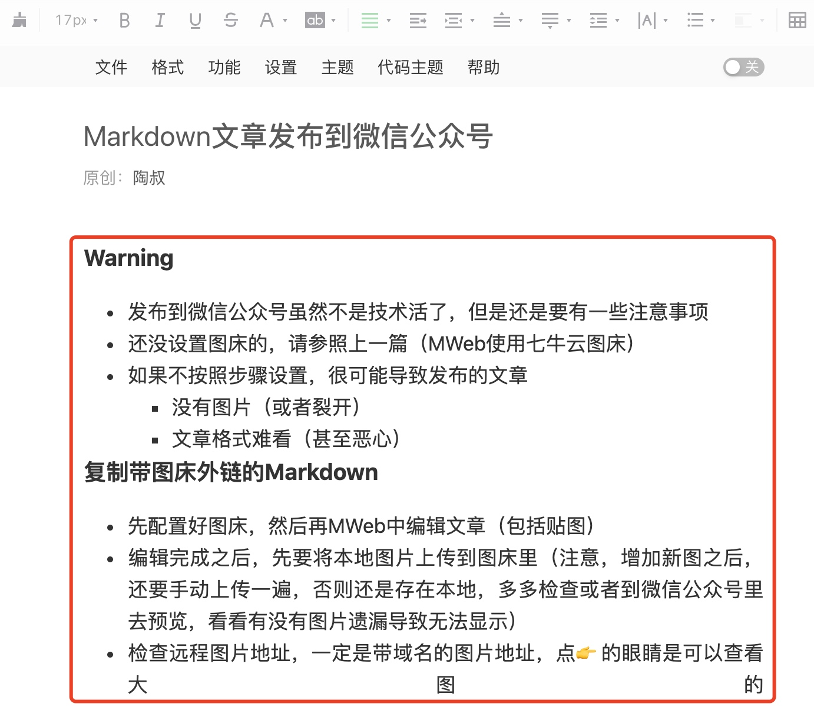
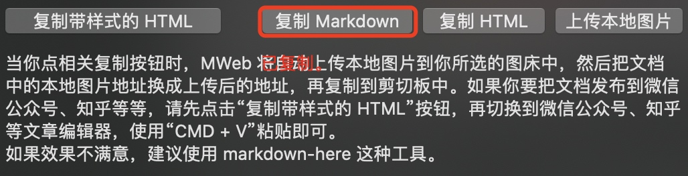
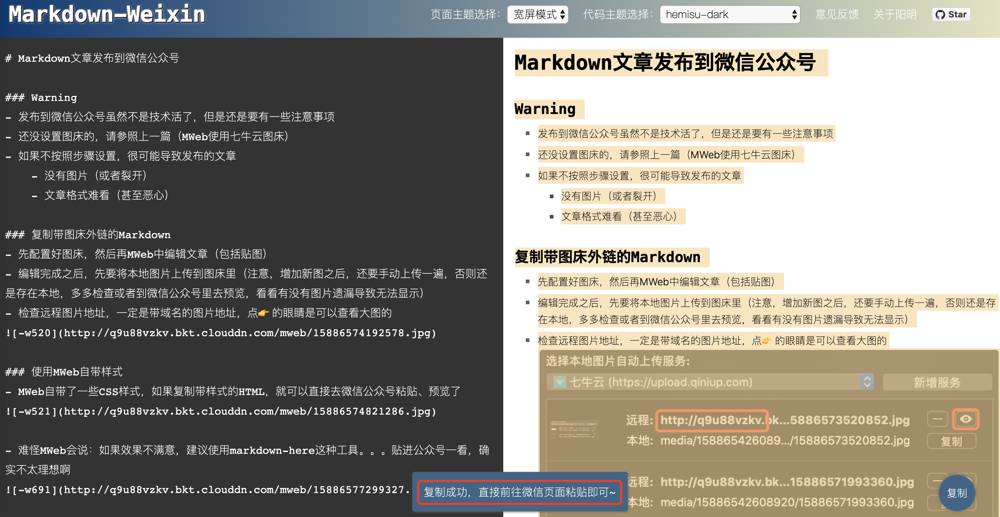
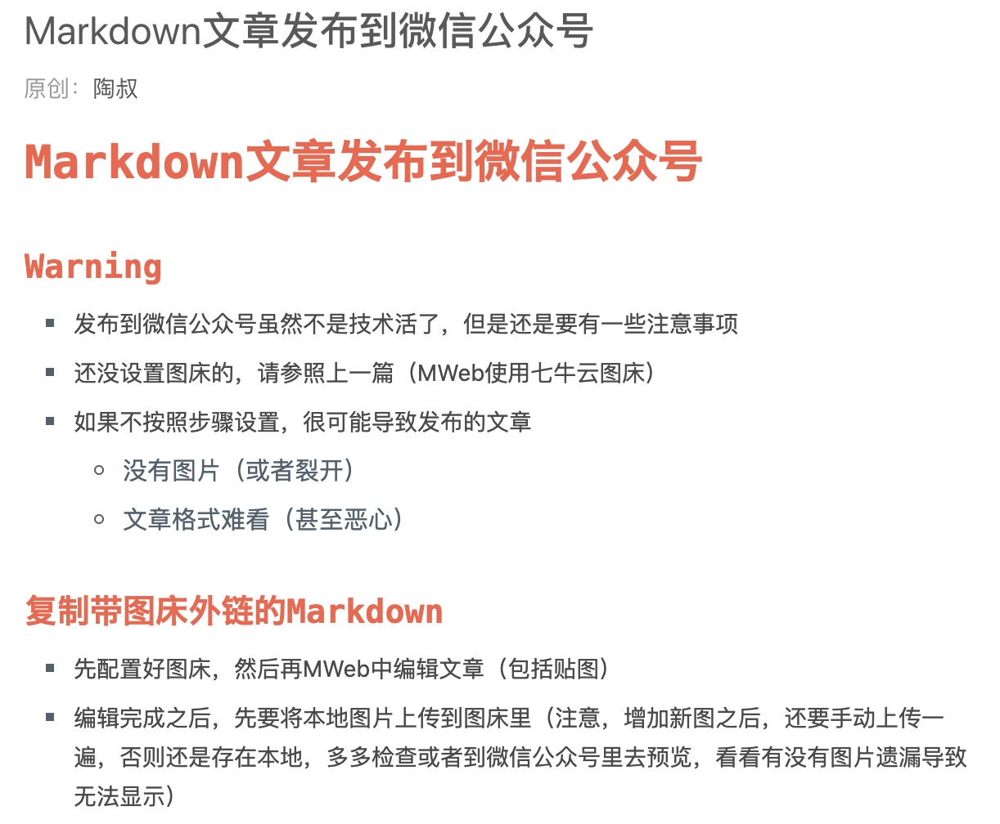
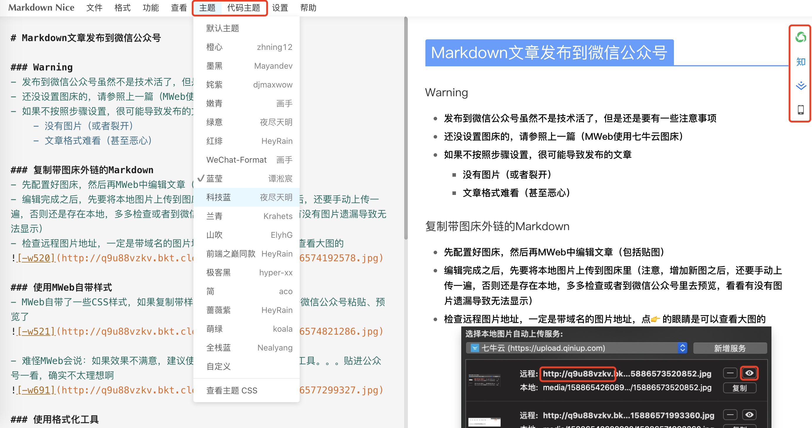
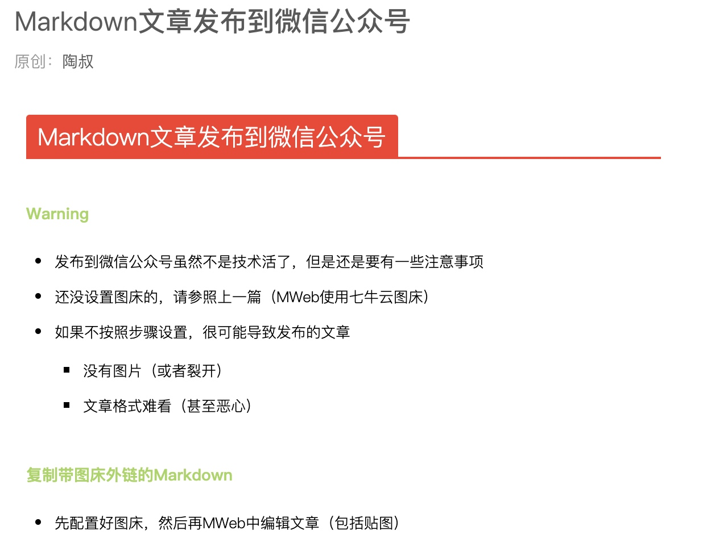
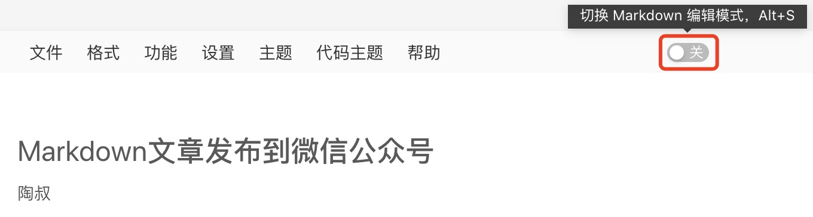
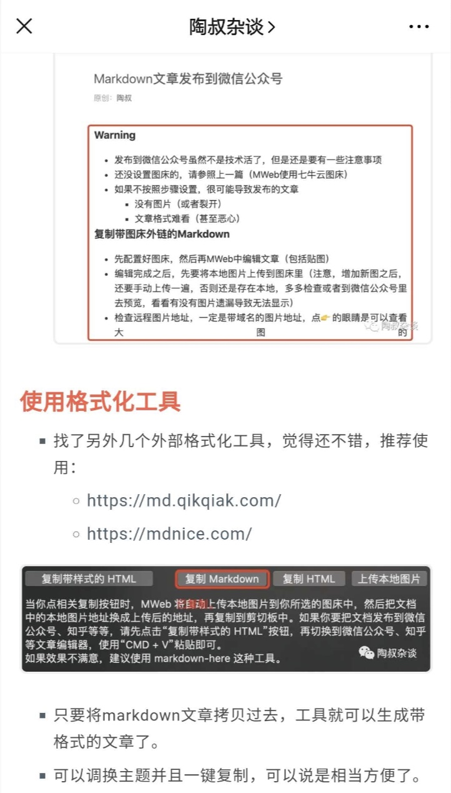

# Markdown文章发布到微信公众号

### Warning
- 发布到微信公众号虽然不是技术活了，但是还是要有一些注意事项
- 还没设置图床的，请参照上一篇（MWeb使用七牛云图床）
- 如果不按照步骤设置，很可能导致发布的文章
    - 没有图片（或者裂开）
    - 文章格式难看（甚至恶心）

### 复制带图床外链的Markdown
- 先配置好图床，然后再MWeb中编辑文章（包括贴图）
- 编辑完成之后，先要将本地图片上传到图床里（注意，增加新图之后，还要手动上传一遍，否则还是存在本地，多多检查或者到微信公众号里去预览，看看有没有图片遗漏导致无法显示）
- 检查远程图片地址，一定是带域名的图片地址，点👉的眼睛是可以查看大图的

### 使用MWeb自带样式
- MWeb自带了一些CSS样式，如果复制带样式的HTML，就可以直接去微信公众号粘贴、预览了

- 难怪MWeb会说：如果效果不满意，建议使用markdown-here这种工具。。。贴进公众号一看，确实不太理想啊

### 使用格式化工具
- 找了另外几个外部格式化工具，觉得还不错，推荐使用：
    - https://md.qikqiak.com/
    - https://mdnice.com/

- 只要将markdown文章拷贝过去，工具就可以生成带格式的文章了。
- 可以调换主题并且一键复制，可以说是相当方便了。
- 举几个栗子，是不是比原生的好看多了？

### 发布到微信公众号
- 注意：如果使用格式化工具，复制之后就已经带格式了，请把微信公众号里的Markdown编辑模式关掉

- 手机端预览，没问题之后就可以直接发布了

> 参考文章：
> https://github.com/mdnice/markdown-nice
> http://blog.didispace.com/markdown-convert-to-weixin/
